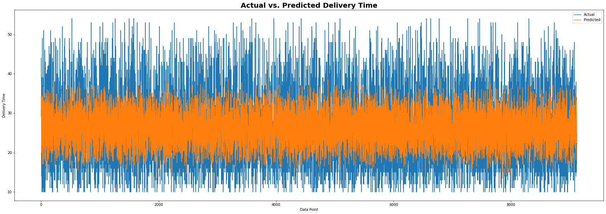

# DelivTimeAI

The DelivTimeAI project leverages Conformalized Quantile Regression to forecast Food Delivery Time with Uncertainty Quantification. In today's world where e-commerce is ubiquitous and most goods are shipped with an ETA estimator, uncertainty quantification becomes crucial for accurate delivery time predictions.

## Sections

The project is divided into three sections:

### 1) EDA

In this section, I performed exploratory data analysis on the dataset. The dataset is loaded as a pandas dataframe and contains the following features:

- ID
- Delivery_person_ID
- Delivery_person_Age
- Delivery_person_Ratings
- Restaurant_latitude
- Restaurant_longitude
- Delivery_location_latitude
- Delivery_location_longitude
- Type_of_order
- Type_of_vehicle
- Time_taken(min)

I conducted a comprehensive analysis of the dataset to gain key insights, including:

- Number of delivery persons
- Distribution and average age of delivery persons
- Most popular type of order
- Most popular type of delivery vehicle
- Average distance per order
- Average time taken per order
- Factors affecting delivery time the most
- Average rating and factors affecting it the most

Through this analysis, I gained an understanding of the features that have the most significant impact on delivery time.

### 2) Regression using a Neural Network in PyTorch

In the second section, I implemented regression using a neural network in PyTorch. After training the model for 1000 epochs, I achieved a low root mean squared error (RMSE) of 8.2. However, the results were not satisfactory as they did not provide enough useful information for decision-making purposes. Below is the graph of the initial model results:

### 3) Conformalized Quantile Regression for Prediction Intervals

In this section, I utilized Conformalized Quantile Regression (CQR) to create prediction intervals for delivery time. CQR provides an intuitive way of uncertainty quantification by outputting a lower bound and an upper bound within which the true value is likely to lie. The length of the prediction interval is shorter for more certain predictions and larger for less certain ones.

The CQR approach offers two essential components:

- Coverage guarantee from a prespecified required coverage rate, which can be used as a hyperparameter.
- Dynamic prediction intervals that are as short as possible.

I implemented CQR using the LightGBM and MAPIE libraries. The results obtained include a coverage rate of 0.9, indicating that 90% of the true values lie within the predicted intervals. The prediction intervals are dynamic and as short as possible. The results are shown in the image below:

## Future Work

Future work on this project can focus on further optimizing the model to achieve even higher coverage rates and shorter prediction intervals. Additionally, deploying the model on an e-commerce website can provide valuable insights and accurate delivery time estimates to customers.

Feel free to explore the code and experiment with different approaches to enhance the accuracy and efficiency of the DelivTimeAI model.

